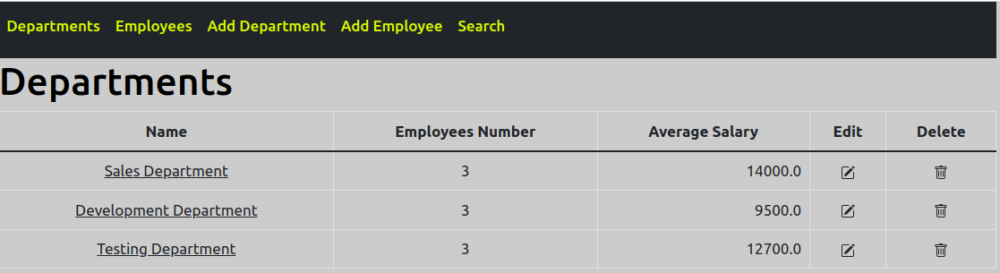
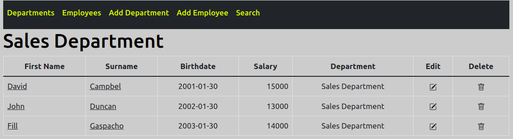
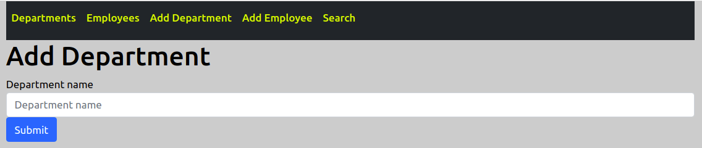
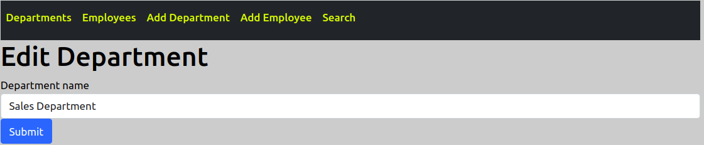
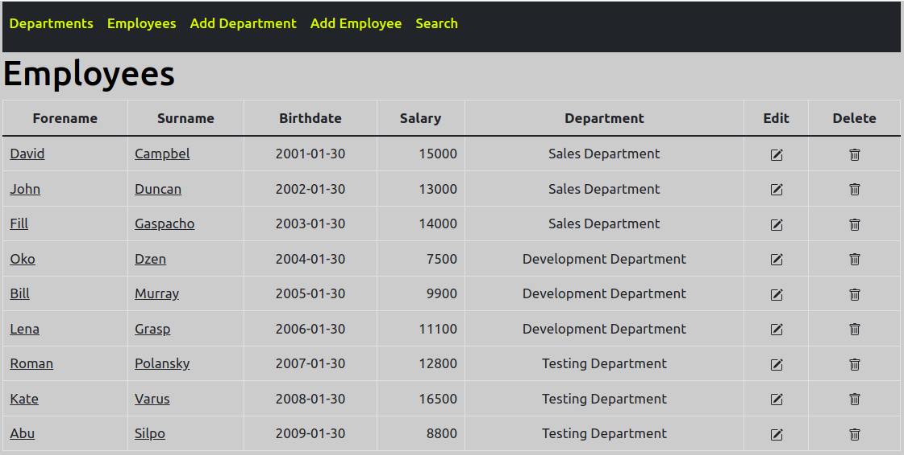
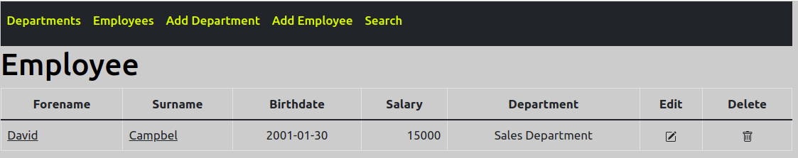
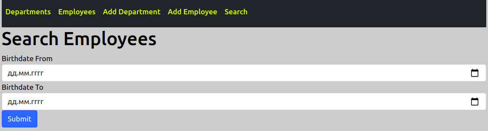
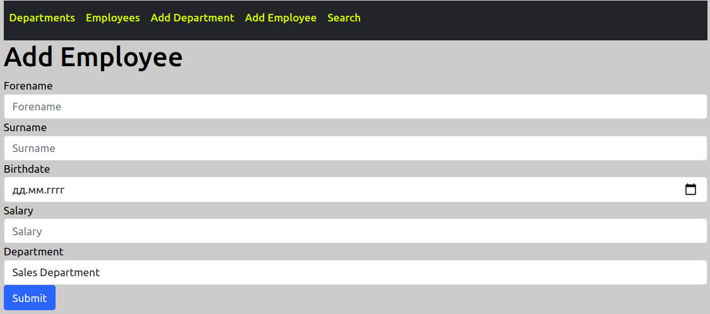
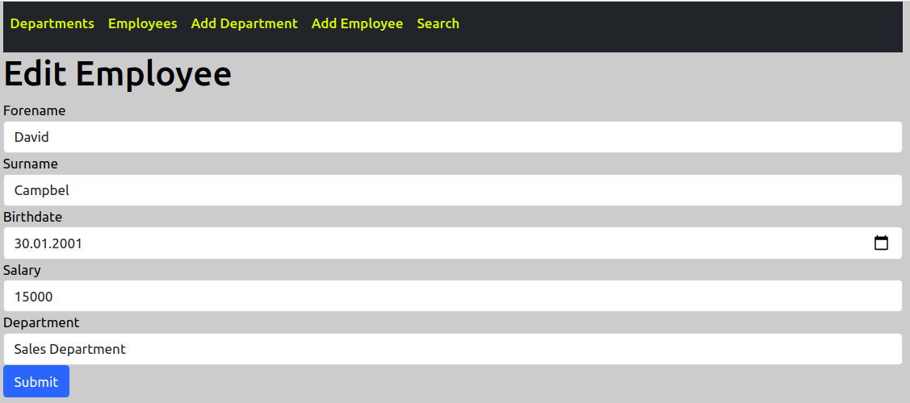

# Department App

## 1 Vision

Department App is web application which allows users to record information about departments and employees.

Application should provide:
- Storing departments and employees in database;
- Display list of departments;
- Managing list of departments (adding, editing, removing);
- Display list of employees;
- Managing list of employees (adding, editing, removing);
- Searching employees by birthdate.

## 2 Departments
### 2.1 Display list of departments

***Main scenario:***

- User enters the site or clicks the "Departments" link in the navbar;
- Application displays list of departments.

Pic 2.1 List of departments

The list displays the following columns:
- Name of department;
- Employee number in department;
- Average salary of all employees in department;
- Edit department;
- Delete department.

### 2.2 Display department

***Main scenario:***

- User clicks the "Name" link in the row assigned to relevant department;
- Application displays all employees assigned to this department.

Pic 2.2 Department

The list displays the following columns:
- Employee's first name;
- Employee's Surname;
- Employee's name of department;
- Employee's birthdate;
- Employee's salary;
- Edit employee;
- Delete employee.

### 2.3 Add department

***Main scenario:***

- User clicks the "Add Department" link in the navbar;
- Application displays field for entering name of department;
- User enters data and presses the "Submit" button;
- If department with this name exists in database, application proposes to enter data once more;
- If entered data is valid, record is added to database and application displays list of departments.

Pic 2.3 Add department

The contains following field:
- Name of department.

### 2.4 Edit department

***Main scenario:***

- User clicks the "Edit Department" link in the row assigned to relevant department;
- Application displays field for entering name of department;
- User enters data and presses the "Submit" button;
- If department with this name exists in database, application proposes to enter data once more;
- If entered data is valid, record is updated in database and application displays list of departments.

Pic 2.4 Edit department

The contains following field:
- Name of department.

### 2.5 Delete department

***Main scenario:***

- User clicks the "Delete Department" link in the row assigned to relevant department;
- Record is deleted from database and all employees assigned to this department are deleted too.

## 3 Employees
### 3.1 Display list of employees

***Main scenario:***

- User clicks the "Employees" link in the navbar;
- Application displays list of employees.

Pic 3.1 List of employees

The list displays the following columns:
- Employee's first name;
- Employee's Surname;
- Employee's name of department;
- Employee's birthdate;
- Employee's salary;
- Edit employee;
- Delete employee.

### 3.2 Display employee

***Main scenario:***

- User clicks the "First Name" or "Surname" link in the row assigned to relevant employee;
- Application displays information about employee.

Pic 3.2 Employee

The list displays the following columns:
- Employee's first name;
- Employee's Surname;
- Employee's name of department;
- Employee's birthdate;
- Employee's salary;
- Edit employee;
- Delete employee.

### 3.3 Search employees

***Main scenario:***

- User clicks the "Search" link in the navbar;
- Application displays fields for entering start and end dates of birth;
- User enters data and presses the "Submit" button, all fields must be filled;
- Application displays all employees born between mentioned dates.

Pic 3.3 Search employees

The contains following fields:
- Start date of birth;
- End date of birth.

### 3.4 Add employee

***Main scenario:***

- User clicks the "Add Employee" link in the navbar;
- Application displays fields for entering employee's first name, Surname, name of department, birthdate and salary;
- User enters data and presses the "Submit" button, all fields must be filled;
- If entered data is valid, record is added to database and application displays list of employees.

Pic 3.4 Add employee

The contains following fields:
- Employee's first name;
- Employee's Surname;
- Employee's name of department;
- Employee's birthdate;
- Employee's salary.

### 3.5 Edit department

***Main scenario:***

- User clicks the "Edit Employee" link in the row assigned to relevant employee;
- Application displays field for entering data of department;
- User enters data and presses the "Submit" button;
- If department with this name exists in database, application proposes to enter data once more;
- Record is updated in database and application displays list of employees.

Pic 3.5 Edit employee

The contains following field:
- Employee's first name;
- Employee's Surname;
- Employee's name of department;
- Employee's birthdate;
- Employee's salary.

### 3.6 Delete employee

***Main scenario:***

- User clicks the "Delete Employee" link in the row assigned to relevant employee;
- Record is deleted from database.
